# Process

In this document you can read all about my process.

## Design

For this design I wanted to create a sidebar to navigate to the items of the onepager. On the top of the page will be a picture/avatar of me with my name, age and profession next to it. On the page I will have 4 sections: Who am I?, My Music, My Location and Socials. All the socials have their own logo that I will use as icon in the side bar, but I also needed general icon for the socials. Therefore I made some sketches of icons that could represent the socials.

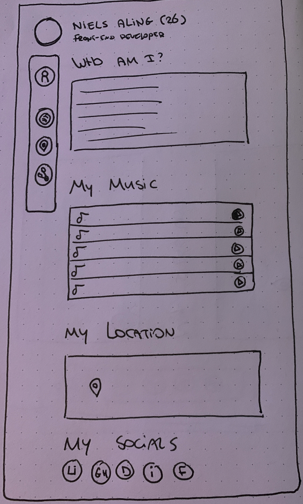


## Breakdown

To make sure I have a clear understanding of what I need to do, I made a breakdown of the website. The navigation bar will be on the left side of the page, but to make sure it's still semantic it will be in de header of the website. The header will also contain the avatar and the name, age and profession. In the main section of the website I will have 4 sections: Who am I?, My Music, My Location and Socials.

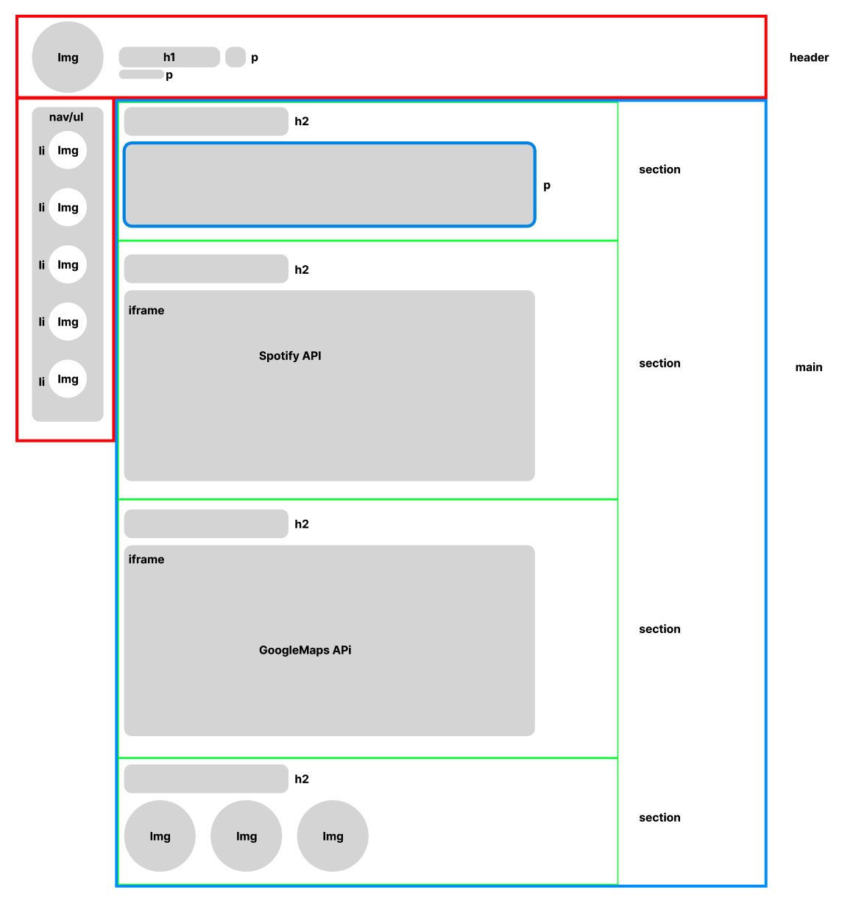

## Node.js, Express and EJS

To make my website dynamic I needed to create a server with Node.js. Bas helped me out with setting this up. I've done it before with block tech but that was a while ago so it was good for me to follow his workshop. We used express as framework and EJS as template engine.

### Spotify

With this server I wanted to make use of the Spotify Web API. This was pretty hard and in the beginning I didn't understand anything of it. We started with Authorization code of Spotify which I actually do not need, but was good for me to learn a little bit about.

First we needed to generate a client id and a client_secret and configure some settings to get started.

```js
const client_id = process.env.SPOTIFY_CLIENT_ID;
const client_secret = process.env.SPOTIFY_CLIENT_SECRET;
const redirect_uri = `http://localhost:${port}/callback`;
```

#### Login

The following part of the code makes tells us what should happen when we go to the login page and the callback page (this is the page you are redirected to after you are logged in). In the try scope we use the spotify api to let the user login with their site.

```js
// login
app.get("/login", function (req, res) {
  try{
    var scope = "user-read-private user-read-email";

    res.redirect(
      "https://accounts.spotify.com/authorize?" +
        querystring.stringify({
          response_type: "code",
          client_id: client_id,
          scope: scope,
          redirect_uri: redirect_uri,
        })
    );
  } catch (error) {
    console.error(error);
    res.status(500).send("Internal Server Error");
  }
});

// callback after login
app.get("/callback", async function (req, res) {
  try{
    return res.send("You are logged in");
  } catch (error) {
    console.error(error);
    res.status(500).send("Internal Server Error");
  }
});
```

When you are logged in Spotify will redirect you back to the callback page:

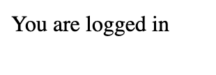

#### Fetch Playlists

I didn't need a login page, but wanted to fetch my playlists. To do this I needed a Spotify token which is requested in the top of the getMyPlaylists function. When I have a token I am allowed to make requests. In this request I fetch all the public playlists of my account which is done with this url: "https://api.spotify.com/v1/users/niels.aling/playlists". After fetching I put the data I need in the variable "playlistItems" and return this so I can give this dat to the front-end. 

```js
// spotify token
var authOptions = {
  url: "https://accounts.spotify.com/api/token",
  headers: {
    Authorization:
      "Basic " +
      new Buffer.from(client_id + ":" + client_secret).toString("base64"),
      "Content-type": "application/x-www-form-urlencoded",
  },
  form: {
    grant_type: "client_credentials",
  },
  json: true,
};

// using the token to get all playlists
const getMyPlaylists = async () => {
  const response = await fetch(authOptions.url, {
    method: "POST",
    body: querystring.stringify(authOptions.form),
    headers: authOptions.headers,
  });

  const token = await response.json();

  const playlists = await fetch(
    "https://api.spotify.com/v1/users/niels.aling/playlists",
    {
      headers: {
        Authorization: "Bearer " + token.access_token,
      },
    }
  );

  const playlistsJson = await playlists.json();
  const playlistItems = playlistsJson.items;
 
  return (playlistItems);
};
```

The problem with this was that in the data there was no album cover. This could only be done by fetching the individual playlists. This could be done by playlist ID. So I used the data from the previous function to do that.

```js
const getPlaylistInfo = async () => {
  const response = await fetch(authOptions.url, {
    method: "POST",
    body: querystring.stringify(authOptions.form),
    headers: authOptions.headers,
  });

  const token = await response.json();

  const playlistIds = await getPlaylistsIds();

  const playlists = [];

  for (let i = 0; i < playlistIds.length; i++) {
    const playlist = await fetch(
      `https://api.spotify.com/v1/playlists/${playlistIds[i]}`,
      {
        headers: {
          Authorization: "Bearer " + token.access_token,
        },
      }
    ).then(response => response.json());
    playlists.push(playlist);
    
    }

    // console.log(playlists);
    return playlists;
};
```

After a lot of struggling I managed to get all the playlist by their ID's. The weird thing was, when returning the data I was not able to see the images. In the console log it waS defined as Objects and if I would be more specific with the console log it said undefined. Since I was already spending a lot of time on this I decided to let it rest for a bit and came up with another solution.

#### Music Players

Since I wanted to be able to play the music I was fetching, I decided to use the ID's and the names of the playlists I could fetch. I send this data to the home page in the server and with EJS I made a forEach loop, so for every playlist it could find it would make an article element with a title and an embedded iframe from Spotify. In the title I put the playlist name and in the iframe I use the fetched id to make sure it grabs the right iframe.

```js
// home
app.get("/", async function (req, res) {
    const playlists = await getMyPlaylists();
    console.log(playlists[0].id);

    res.render("pages/index", { playlists });
});
```

```html
<section class="playlistContainer">
    <% playlists.forEach(playlist => { %>
        <article>
          <h3><%= playlist.name %></h3>
          <iframe style="border-radius:12px" src="https://open.spotify.com/embed/playlist/<%= playlist.id %>?utm_source=generator" width="100%" height="152" frameBorder="0" allowfullscreen="" allow="autoplay; clipboard-write; encrypted-media; fullscreen; picture-in-picture" loading="lazy"></iframe>            
        </article>
    <% }); %>
</section>
```

after some styling it ended up like this:

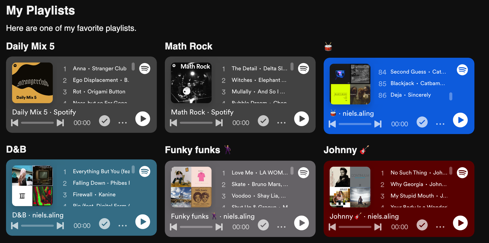

## Avatar

I wanted to create a cool avatar that represented me, but I'm not that good in creating that sort of things, so I wanted to try out Dall-e from Chat-gpt for this and see what it could make for me. My prompt was really simple: "give me a illustrated drum set".

It came up with the following images:

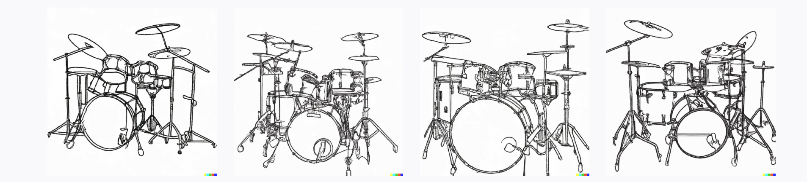

I found this to boring so I changed the prompt to "give me a pixelart drumset with purple, black and yellow.

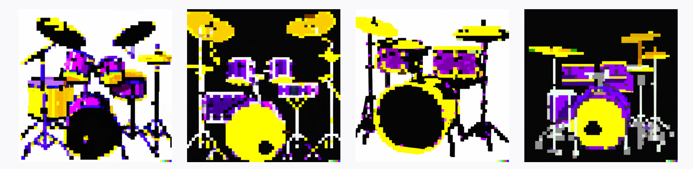

This was also not really what I was looking for so I changed the prompt again to "give me a cool illustrated drum set with a lightning bold on the bass drum, and the result were much better:

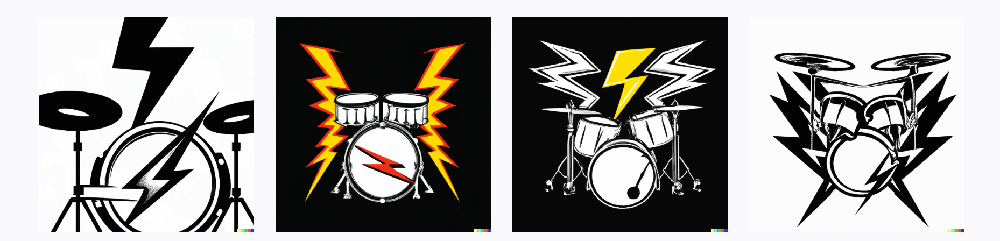

I decided to make a variation on the third image:

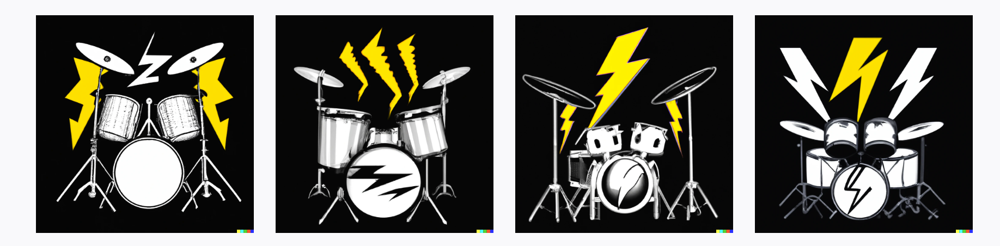

I wanted to go a little deeper and made another variation on the 4th image:

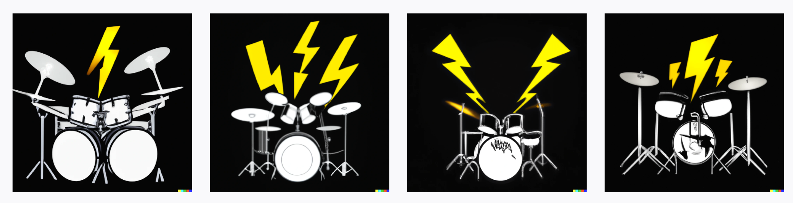

I wasn't to happy about the results so I went back to the third prompt I gave and made a variation to the second image:

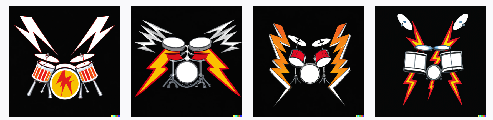

This time I really liked the third image and decided to use this as an avatar. I made 2 versions of it to use, one with a black background and one with a transparent background that I could use for the team website.

## User Data

With the team we decided to use our name, age, avatar and our Github, Discord and linkedIn socials as data for the team website. This also had to be the user data on my personal website, but just in case we would decide to add more data to the team website I made a Json file with all the data I could think of.

```json
{
    "name": "Niels Aling",
    "age": 26,
    "country": "Netherlands",
    "languages": [
        "Dutch",
        "English"
    ],
    "education": [
        {
            "school": "Hogeschool Rotterdam",
            "degree": "Bachelor of Science",
            "field": "Communication and Multimedia Design"
        }
    ],
    "work": [
        {
            "company": "aardig",
            "position": "Front-end Developer",
            "duration": "2023 - Present"
        }
    ],
    "programming languages": [
        "Python",
        "JavaScript",
        "HTML",
        "CSS",
        "C++"
    ],
    "tools": [
        "VSCode",
        "Git",
        "GitHub",
        "Node.js",
        "MongoDB",
        "React",
        "Express",
        "Next.js",
        "Figma",
        "Adobe CC",
        "Miro",
        "Webflow"
    ],
    "hobbies": [
        "Coding",
        "Gaming",
        "Watching Anime",
        "Drumming"
    ],
    "socials": [
        {
            "github": "https://github.com/N13L5A97",
            "linkedIn": "https://www.linkedin.com/in/niels-aling/",
            "discord": "http://discordapp.com/users/767661823855034368"
        }
    ],
    "images": [
        {
            "transparent": "https://raw.githubusercontent.com/N13L5A97/web-app-from-scratch-2324/main/public/assets/images/avatar_transparent.png",
            "black": "https://raw.githubusercontent.com/N13L5A97/web-app-from-scratch-2324/main/public/assets/images/avatar_black.png"
        }
    ]
}
```

On the server side I created a function to fetch this data and send this to the homepage. For now I only use my name, age, work position, avatar and socials.

```js
// home
app.get("/", async function (req, res) {
    const userData = await fetchUserData();
    const userImage = userData.images[0].black;
    const userSocials = userData.socials;

    console.log(userData);

    res.render("pages/index", { userData, userImage, userSocials });
});

const fetchUserData = async () => {
  try{
    const data = fs.readFileSync("data.json", "utf8");
    userData = JSON.parse(data);
    return userData;
  } catch (error) {
    console.error(error);
  }
};
```

After sending it to the front-end I could implement it in the place I wanted it. In this case the title of the page (my name and age), my work position and my avatar.

```html
  <section class="userInfo">
      " class="avatar" alt="avatar">
      <section>
          <h1><%= userData.name %> <span>(<%= userData.age %>)</span> </h1>
          <p> <%= userData.work[0].position %> </p>
      </section>
  </section>
```

In the end it looked like this:

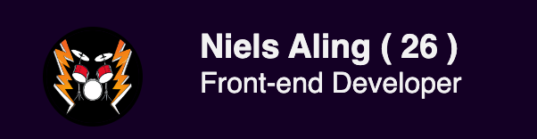

## Fetching Playlists in the Front-end

At the moment I fetch all the data server-side but this is not necessary at all. And since I also need to fetch data in the front-end I had to make some changes in my code. At first I fetched my playlists and rendered them together with the page I should be on, now I just make the get request on the serverside.

```js
app.get("/playlists", async function (req, res) {
  const playlists = await getMyPlaylists();
  res.json(playlists);
});
```

I made a folder for my scripts in the public folder so I can fetch this data in the front-end. I do this by fetching the url I just created, format it to json and return the data. Now I can access the data in the front-end.

```js
const getPlaylists = async () => {
    const playlists = await fetch("http://localhost:3001/playlists");
    const playlistsJson = await playlists.json();
    console.log(playlistsJson);
    return playlistsJson;
};
```

After fetching the playlists I had to create a couple elements so I can put this in my HTML. In my code I say that for each playlist it can find make an article, a h3 heading and a iframe. Put the playlist name in the heading, put the iframe attributes in the iframe with the right playlist id and put both the iframe and the heading in the article. After that I find the section in my HTML where the articles should be placed and put them in there.

I had some problems with inserting the iframe because it wouldn't insert into the HTML. I asked this to chatGPT and I found out I could only give the append child function one value so I had to insert them separately. I also didn't know how to give the iframe the right value's and found out that the frameborder
should be inserted as an attribute. [Go to ChatGPT Conversation](https://chat.openai.com/share/5eebe267-1e5f-49f8-8e08-a02c68a417c7)

```js
const createPlaylist = async () => {
    const playlists = await getPlaylists();

    playlists.forEach(playlist => {
        //create article for each playlist
        const playlistArticle = document.createElement('article');

        //create title for each playlist
        const playlistTitle =  document.createElement('h3');
        playlistTitle.innerHTML = playlist.name;

        //create iframe for each playlist
        const playlistIframe = document.createElement('iframe');

        //iframe info
        playlistIframe.src = `https://open.spotify.com/embed/playlist/${playlist.id}?utm_source=generator`;
        playlistIframe.loading = "lazy";
        playlistIframe.setAttribute('frameborder', '0');


        // insert title and iframe into article
        playlistArticle.appendChild(playlistTitle);
        playlistArticle.appendChild(playlistIframe);

        //insert article into section
        const playlistSection = document.querySelector('.playlistContainer');
        playlistSection.appendChild(playlistArticle);
    });
};

createPlaylist();
```

## Styling & Content

After all the data inserting I wanted to focus a little more on styling and content. I used Coolors website to generate a color palette and when I finally found some cool colors I made the regular variables and the dark mode variables for my website.

### Coolors

```css
  :root{
    --background-color: #f5f5f5;

    --text-color-primary: #2d3142;
    --text-color-secondary: #4f5d75;

    --accent-color: #ef8354;
}

/* dark mode */

@media (prefers-color-scheme: dark){
    :root{
        --background-color: #2d3142;
        --text-color-primary: #f5f5f5;
        --text-color-secondary: #bfc0c0;
    }
}
```

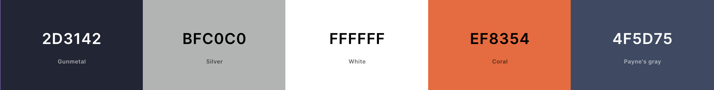

### Fonts

I used Roboto as a standard font but wanted something more industrial to fit my color palette. I looked on Google fonts and I didn't took me long to find a good matching font. It's called Rajdhani by [Indian Type Foundry](https://fonts.google.com/?query=Indian%20Type%20Foundry). I used Google Fonts because I think it's the easiest way to import fonts. I also added some fallback fonts in case the the font wasn't found by the browser.

```css
root{
   --font-family: 'Rajdhani', 'Roboto', Arial, sans-serif;
}
```

### Content

My pages were quite empty still so I had to add some content to make my website more interesting.

#### Footer

I thought of adding content to the socials page but found it more logical to move the social links to the footer. These links were still fetch on the server side so I also changed that. I think the footer looks way better this way.

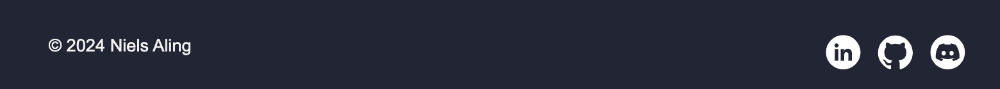

The data was still fetched on the server side so I had to fix that as well. I had some trouble with this because the console.log kept saying "Cannot set properties of null (setting 'href') at insertSocialLinks".

```js
  const insertSocialLinks = async () => {
    const userData = await fetchUserData();
    console.log(userData.socials[0].github);

    const github = document.getElementById('#github');
    const linkedin = document.getElementById('#linkedin');
    const discord = document.getElementById('#discord');

    github.href = userData.socials[0].github;
    linkedin.href = userData.social[0].linkedin;
    discord.href = userData.social[0].discord;
}
```

Since it would be logical to only show the icons in the footer if the links are found I decided to create them all in Javascript.

```js
  const insertSocialLinks = async () => {
    const userData = await fetchUserData();
    console.log(userData.socials[0].linkedIn);

    //create a link for github
    const github = document.createElement('a');
    github.href = userData.socials[0].github;

    const githubIcon = document.createElement('img');
    githubIcon.src = "./assets/icons/github_logo.svg";
    githubIcon.alt = "Github";

    github.appendChild(githubIcon);

    //create a link for linkedin
    const linkedin = document.createElement('a');
    linkedin.href = userData.socials[0].linkedIn;

    const linkedinIcon = document.createElement('img');
    linkedinIcon.src = "./assets/icons/linkedin_logo.svg";
    linkedinIcon.alt = "Linkedin";

    linkedin.appendChild(linkedinIcon);

    // create a link for discord
    const discord = document.createElement('a');
    discord.href = userData.socials[0].discord;

    const discordIcon = document.createElement('img');
    discordIcon.src = "./assets/icons/discord_logo.svg";
    discordIcon.alt = "Discord";

    discord.appendChild(discordIcon);

    const socialsSection = document.querySelector('.socials');
    socialsSection.appendChild(github);
    socialsSection.appendChild(linkedin);
    socialsSection.appendChild(discord);
}
```

## Responsiveness

### Playlists

To make my site as accessible as possible I also have to make my site responsive. While developing I already noticed my playlists got in the way when scaling down the screen size so I started with fixing this. I created 2 media queries so the playlists would line up a little better.

```css
@media (max-width: 1126px){
    .playlistContainer article{
        width: 32%;
    }
}

@media (max-width: 1030px){
    .playlistContainer article{
        width: 45%;
        height: 20%;
    }
}
```

I remembered this could be done much easier with flex so I looked it up on [MDN](https://developer.mozilla.org/en-US/docs/Web/CSS/CSS_flexible_box_layout/Mastering_wrapping_of_flex_items) and changed it a little. I removed the media queries and added "flex: 1 1 20rem;" to the .playlist article. the first 2 values stand for flex shrink and flex grow and the last value (20em) is flex basis which means that is it's original size. If a article of 20em does not fit on the row it will create another row.

```css
/* playlist page */
.playlistContainer{
    display: flex;
    gap: 1em;
    flex-wrap: wrap;
    align-content: center;
}

.playlistContainer article{
    flex: 1 1 20rem;
}

.playlistContainer iframe{
    height: 100%;
    width: 100%;
}
```

### Sidebar

The second thing I wanted to fix was the side bar. When the screen gets to small the sidebar is to big so I wanted to move this to the top.

## Resources

- [Read/Write json files](https://heynode.com/tutorial/readwrite-json-files-nodejs/#:~:text=json%20file%2C%20we%20will%20use,%22fs%22)
- [Spotify Web API](https://developer.spotify.com/documentation/web-api)
- [How to use EJS](https://www.digitalocean.com/community/tutorials/how-to-use-ejs-to-template-your-node-application)
- [How to use forEach loop EJS](https://biplabsinha345.medium.com/how-to-use-foreach-loop-in-node-js-template-engine-a460273b652)
- [Scroll Behavior](https://developer.mozilla.org/en-US/docs/Web/CSS/scroll-behavior)
- [Dall-e](https://openai.com/dall-e-2)
- [Creating New HTML Elements](https://www.w3schools.com/js/js_htmldom_nodes.asp)
- [Insert iframe into HTML with Javascript](https://chat.openai.com/share/5eebe267-1e5f-49f8-8e08-a02c68a417c7)
- [Prefers Color Scheme](https://developer.mozilla.org/en-US/docs/Web/CSS/@media/prefers-color-scheme)
- [Color Palette Generator](https://coolors.co/2d3142-bfc0c0-ffffff-ef8354-4f5d75)
- [Rajdhani Font](https://fonts.google.com/specimen/Rajdhani?preview.text=My%20Playlists&preview.size=88&stroke=Sans+Serif&stylecount=3)
- [MDN - flex wrap](https://developer.mozilla.org/en-US/docs/Web/CSS/CSS_flexible_box_layout/Mastering_wrapping_of_flex_items)
