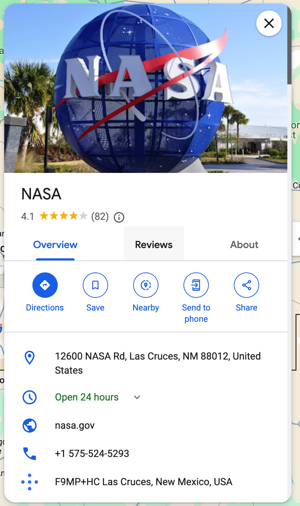
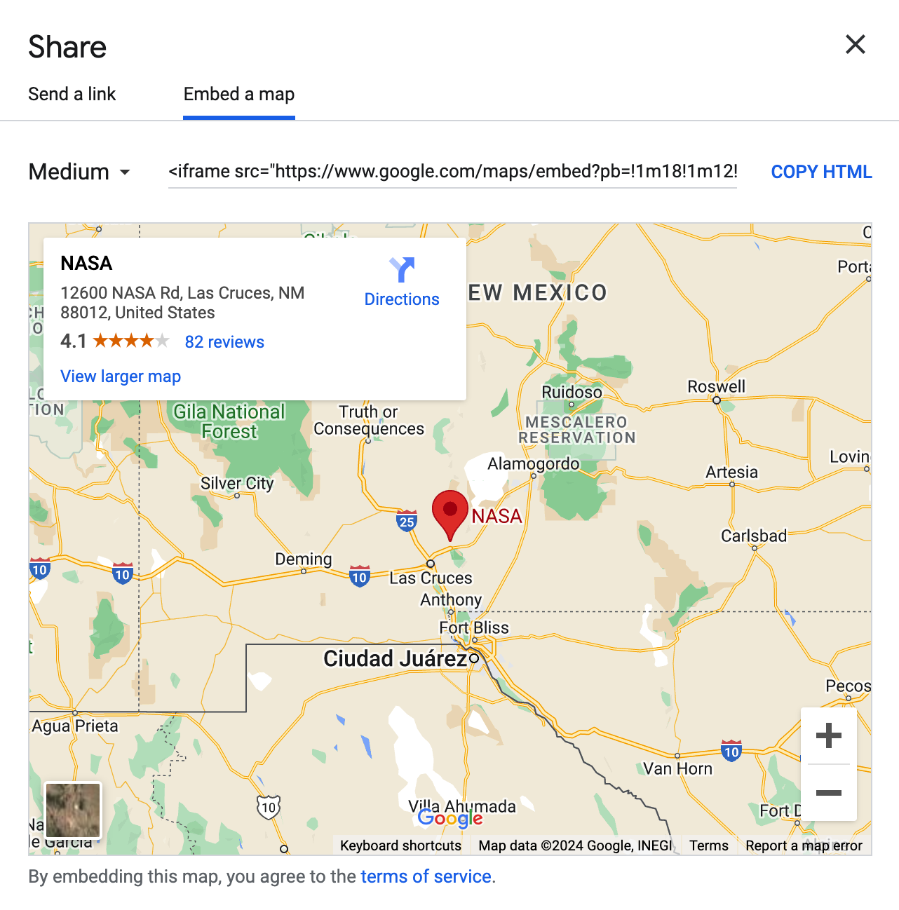
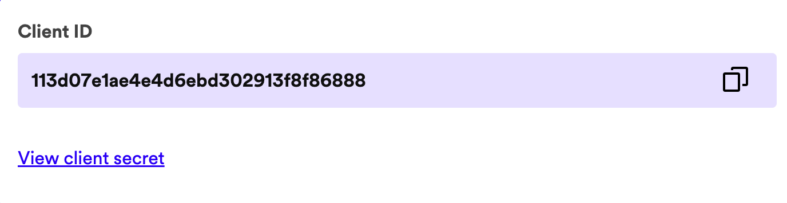

# Welcome to my Webapp From Scratch

## The Project

This project is a personal one pager where I fetch my personal data from a json file. I used a Spotfy API to fetch my public playlist. In this read me I will explain how I managed to build this project.

## Clone and use this project

To clone this project enter the following code in your terminal:

```zsh
git clone https://github.com/N13L5A97/web-app-from-scratch-2324.git
```

Install all the packages:

```zsh
npm i
```

Run the server.js (with nodemon)

```zsh
npm start
```

## Set up Node Server

Since we are going to use a Spotify API with a client secret and client_ID we we have to create a node server. We do this with express and we will be using EJS as template engine. When setting this up make sure you have Node.js installed on your computer and enter the following code in the command line:

Creates a package.json file:

```zsh
npm init -y
```

Install express:

```zsh
npm install express
```

Install ejs:

```zsh
npm install ejs
```

Install Nodemon:

```zsh
npm install nodemon
```

Install dotenv:

```zsh
npm install dotenv
```

### Set up Server

Create a file named server.js. This is the script that will render your website. We need to tell this file that it needs to use express and a .env file. We do that with the following code in the top of the file:

```js
require("dotenv").config();
const express = require("express");
const app = express();
const port = process.env.PORT;
```

Create a new file named .env and put your port number in there like this.

```.env
PORT = "3001"
```

In the .env file you can put data that is not supposed to be seen by others. Think of your port number api keys or database credentials. To make sure nobody will see this you have to create a .gitignore file. This file will ignore the files that are written in there while pushing to your repository. Make sure to put the following files in there:

```.gitignore
.DS_Store
.env
/nodemodules
```

With this done we can tell the server.js file what to do. With app.set we tell express to use ejs as view engine and with app.use we tell express to use the public folder for static files. App.get wil set the routes and in this case respond with a text "Hello World". In the bottom of the script you will tell the script to listen to your port number.

```js
app.set("view engine", "ejs");
app.use(express.static("public"));

// home
app.get("/", async function (req, res) {
  // res.render("pages/index");
  res.send("Hello World");
});

app.listen(port, () => {
  console.log(`listening on port ${port}`);
});
```

In the package.json file we will add the script: "start": "nodemon server.js" with this you can start the server.js file with nodemon. If you go to localhost with your given port number you will see your "Hello World" message.

## Set up Files

To finalize the set up we will create a couple of folders and files. Ejs works with views, pages and pratials so we will have to make a folder named views. Inside this folder we have to create 2 other folders; pages and partials. In your pages folder you will place your index.ejs and in your partials folder you create a head.ejs, header.ejs and a footer.ejs file.

### Partials

Partials are used for components that are the same everywhere. This is useful because you don't have to write and modify these components again and again. Put the following elements in the partials. We will dive into these later on.

#### head.ejs

```html
  <head>
  <meta charset="UTF-8">
  <meta name="viewport" content="width=device-width, initial-scale=1.0">
  <title>Minor Web D&D</title>
  <link rel="stylesheet" href="./assets/styles/global.css">
</head>
```

#### footer.ejs

```html
  <footer>
      <p>© 2024 Niels Aling</p>
      <section class="socials">
      </section>
  </footer>
```

#### header.ejs

```html
  <header>
    <h1>Niels Aling Indivudual Website Minor Web</h1>
    <aside>
        <ul>
            <li class="iconContainer">
                <a href="#whoAmI"> </a>
            </li>
            <li class="iconContainer">
                <a href="#myMusic"> </a>
            </li>
            <li class="iconContainer">
                <a href="#myLocation"> </a>
            </li>
        </ul>
    </aside>
    <nav>
        <li class="iconContainer">
            <a href="#whoAmI"> </a>
        </li>
        <li class="iconContainer">
            <a href="#myMusic"> </a>
        </li>
        <li class="iconContainer">
            <a href="#myLocation"> </a>
        </li>
    </ul>   
    </nav>
</header>
```

### Pages

In the pages folder we will create our index.ejs. This will be our homepage. Now we will insert our partials into the homepage with the ejs syntax. Since we made the head as a partial we can insert it above the body. We can do the same for the header and the footer.

```html
<!DOCTYPE html>
<html lang="en">
  <%- include('../partials/head'); %>
  <body class="container">
    <%- include('../partials/header'); %>
    <main>

    </main>
    <%- include('../partials/footer'); %>
  </body>
</html>
```

### Data

Since we want our data to be transferable to other websites we will create a json file in the public folder. Personally I like to put it in another folder like this public > data > info.json.

In this file we will write all the data we want to use for our website and for other websites to find. In my case my info.json will look like this:

```json
  {
    "firstName": "Niels",
    "lastName": "Aling",
    "avatar_url": "https://raw.githubusercontent.com/N13L5A97/web-app-from-scratch-2324/main/public/assets/images/avatar_transparent.png",
    "age": "26",
    "city": "Amsterdam",
    "favouriteAnimal": "Lion",
    "bio":[
        "I'm a 26 year old communication and multimedia student at Hogeschool van Amsterdam.",
        "Currently I am in my 3th year and I'm specializing in front-end development.",
        "I'm also a musician and I love to play guitar and drums.",
        "In my free time I love to watch anime and play video games."
    ],
    "languages": [
        "Dutch",
        "English"
    ],
    "education": [
        {
            "school": "Hogeschool Rotterdam",
            "degree": "Bachelor of Science",
            "field": "Communication and Multimedia Design"
        }
    ],
    "work": [
        {
            "company": "aardig",
            "position": "Front-end Developer",
            "duration": "2023 - Present"
        }
    ],
    "programming languages": [
        "Python",
        "JavaScript",
        "HTML",
        "CSS",
        "C++"
    ],
    "tools": [
        "VSCode",
        "Git",
        "GitHub",
        "Node.js",
        "MongoDB",
        "React",
        "Express",
        "Next.js",
        "Figma",
        "Adobe CC",
        "Miro",
        "Webflow"
    ],
    "hobbies": [
        "Coding",
        "Gaming",
        "Watching Anime",
        "Drumming",
        "Guitar",
        "Volleyball",
        "Basketball",
        "Skateboarding",
        "Lego"
    ],
    "socials": [
        {
            "github": "https://github.com/N13L5A97",
            "linkedIn": "https://www.linkedin.com/in/niels-aling/",
            "discord": "http://discordapp.com/users/767661823855034368"
        }
    ],
    "truthsAndLies":[
        "I have 5 missing teeth",
        "I can solve a Rubiks cube",
        "I have played professional handball"
    ]
}
```

## Set up Index Page

Since we're creating a one pager we only need an index page with a couple of sections. We will create a section for the user information, your favorite playlists and your location. We will give all the sections an ID so we can use this for the navigation. All the sections will have a h2 heading and a container called sectionContainer.

In the "who am I" section we have a section for the content and 2 sections to split the content. Later on we will use the classes to insert the user data into the document and to style the elements.

```html
<section id="whoAmI">
  <h2>Who Am I?</h2>
  <section class="sectionContent">
    <section class="userData"></section>
    <section class="bio"></section>
  </section>
</section>
```

In the "my music" section we hale create a paragraph element for a little description. We will insert the playlists later into playlist container section.

```html
<section id="myMusic">
  <h2>My Playlists</h2>
  <p>Here are one of my favorite playlists.</p>
  <section class="sectionContent">
    <section class="playlistContainer"></section>
  </section>
</section>
```

In the last section we will insert a google maps iframe with a location.

```html
<section id="myLocation">
  <h2>My Location</h2>
  <section class="sectionContent">
    <iframe
      class="locationContainer"
      src="https://www.google.com/maps/embed?pb=!1m18!1m12!1m3!1d2437.920245091633!2d4.8808935121606964!3d52.33559294974938!2m3!1f0!2f0!3f0!3m2!1i1024!2i768!4f13.1!3m3!1m2!1s0x47c60b8f654c3db1%3A0x1a25a0c8704b2206!2sStudent%20Experience%20Amsterdam%20Zuidas!5e0!3m2!1sen!2snl!4v1707221136228!5m2!1sen!2snl"
      width="100%"
      height="450"
      allowfullscreen=""
      loading="lazy"
      referrerpolicy="no-referrer-when-downgrade"
    ></iframe>
  </section>
</section>
```

### Embed Maps Location

To embed a Google Maps location you go your location of choice and click the share button. Choose for the tab embed a map and copy the html.




## Fetch and Insert User Data

Now we have a place to insert the user data, but before we can insert it we have to fetch it.
We do this in a script file in the front-end. For this we make another folder in the public folder called scripts. In this folder we will create a file called script.js and import is in the index.ejs on the bottom of the body tag

```html
  <!-- Rest of the code -->
  <script src="./assets/scripts/script.js"></script>
</body>
```

In the script.js file we will fetch the user data we created earlier from info.json.

```js
const fetchUserData = async () => {
    const userData = await fetch ("./assets/data/info.json");
    const userDataJson = await userData.json();
    return userDataJson;
};
```

### Create User Elements

With the user data we can do multiple things. In this part we will create the elements for the "who am I" section. In the top of the function we fetch the user data from the json file.

With document.create element we can create the elements we need for the user page, with innerHTML we can insert text and other elements into the the elements.

When we want to insert certain data into elements like an image source we can use element.src = "src".

To insert all the data in de right place we can find elements by using the query selector. When our script knows where these elements are we can use append.child to insert the created elements.

```js
const createUserElements = async () => {
    // fetch user data
    const userData = await fetchUserData();

    console.log(userData.bio);

    // create span for user age and put age between ()
    const userAge = document.createElement('span');
    userAge.innerHTML = "(" + userData.age + ")";

    // create h3 for user name
    // insert first name, last name and age into the username
    const userName = document.createElement('h3');
    userName.innerHTML = userData.firstName + " " + userData.lastName + " " + userAge.outerHTML;

    // create img for avatar and add src and alt
    const avatar = document.createElement('img');
    avatar.src = userData.avatar_url;
    avatar.alt = userData.firstName;

    // create p for user work position and insert data
    const userPosition = document.createElement('p');
    userPosition.innerHTML = userData.work[0].position;

    // create p for user bio and insert data
    const dataContainer = document.querySelector('.userData');
    const bio = document.createElement('p');
    bio.innerHTML = userData.bio;

    // put avatar, userName and position into data container
    dataContainer.appendChild(avatar);
    dataContainer.appendChild(userName);
    dataContainer.appendChild(userPosition);

    // insert bio in bio section
    const bioContainer = document.querySelector('.bio');
    bioContainer.appendChild(bio);
};
```

## Fetch and Insert Spotify Playlists

Read the [Spotify Documentation](https://developer.spotify.com/documentation/web-api/tutorials/getting-started) to get started with this API.

To fetch the playlists we need to create a spotify app at the [Spotify Dashboard](https://developer.spotify.com/dashboard).

App Name: My App
App Description: This is my first Spotify app
Redirect URI: You won't need this parameter in this example, so let's use http://localhost:3000.

To request a token we need a client secret and a client_id. You can find this in the settings of your spotify app at your dashboard.



Keep this information to yourself! Especially your client_secret and put this in your .env file.

```env
SPOTIFY_CLIENT_ID = ""
SPOTIFY_CLIENT_SECRET = ""
```

With this information we can request a token:

*server.js*

```js
const client_id = process.env.SPOTIFY_CLIENT_ID;
const client_secret = process.env.SPOTIFY_CLIENT_SECRET;

// spotify token
var authOptions = {
  url: "https://accounts.spotify.com/api/token",
  headers: {
    Authorization:
      "Basic " +
      new Buffer.from(client_id + ":" + client_secret).toString("base64"),
    "Content-type": "application/x-www-form-urlencoded",
  },
  form: {
    grant_type: "client_credentials",
  },
  json: true,
};
```

Every time we want to get our playlists we have to request this token because it expires in 3600 seconds. So in our function we will start by requesting this token. After we gain access we fetch the playlists (in this case my playlists) and put this in a json format. When this is done we return the data.

```js
// using the token to get all playlists
const getMyPlaylists = async () => {
  const response = await fetch(authOptions.url, {
    method: "POST",
    body: querystring.stringify(authOptions.form),
    headers: authOptions.headers,
  });

  const token = await response.json();

  const playlists = await fetch(
    "https://api.spotify.com/v1/users/niels.aling/playlists",
    {
      headers: {
        Authorization: "Bearer " + token.access_token,
      },
    }
  );

  const playlistsJson = await playlists.json();
  const playlistItems = playlistsJson.items;

  return playlistItems;
};
```

We don't want to render this with the page but we want to make this request in the front-end. For that we do need an endpoint. In this case me make that endpoint /playlists. When the front-end will request this url it will await the getMyPlaylists function and return the data.

```js
// used by front-end to get all playlists
app.get("/playlists", async function (req, res) {
  const playlists = await getMyPlaylists();
  res.json(playlists);
});
```

In the front-end we can now make a get request to the backend with this endpoint.

*script.js*

```js
const getPlaylists = async () => {
    const playlists = await fetch("http://localhost:3001/playlists");
    const playlistsJson = await playlists.json();
    // console.log(playlistsJson);
    return playlistsJson;
};
```

With this data we can now create a Spotify embed for each playlist. We have to get the data from the function and then for each playlist we need to create an article, a h3 heading and an iframe element. We give the h3 element the name of the playlist and add the iframe attributes with a dynamic src. This is the id of the playlist. After that we can insert the title and the iframe into the article and the article into the playlist container in the html.

```js
const createPlaylist = async () => {
    const playlists = await getPlaylists();

    playlists.forEach(playlist => {
        //create article for each playlist
        const playlistArticle = document.createElement('article');

        //create title for each playlist
        const playlistTitle =  document.createElement('h3');
        playlistTitle.innerHTML = playlist.name;

        //create iframe for each playlist
        const playlistIframe = document.createElement('iframe');

        //iframe info
        playlistIframe.src = `https://open.spotify.com/embed/playlist/${playlist.id}?utm_source=generator`;
        playlistIframe.loading = "lazy";
        playlistIframe.setAttribute('frameborder', '0');


        // insert title and iframe into article
        playlistArticle.appendChild(playlistTitle);
        playlistArticle.appendChild(playlistIframe);

        //insert article into section
        const playlistSection = document.querySelector('.playlistContainer');
        playlistSection.appendChild(playlistArticle);
    });
};
```

## Styling

Last but not least we have to create some styling to make the website look a little cool. At the top of the page I import a cool font [Rajdhani](https://fonts.google.com/specimen/Rajdhani?preview.text=My%20Playlists&preview.size=88&stroke=Sans+Serif&stylecount=3) by [Indian Type Foundry](https://fonts.google.com/?query=Indian%20Type%20Foundry).

I make a couple variables for colors, font-family and a border-radius in case I want to change these.

```css
@import url('https://fonts.googleapis.com/css2?family=Rajdhani:wght@400;600&display=swap');

:root{
    --background-color: #f5f5f5;

    --text-color-primary: #2d3142;
    --text-color-secondary: #4f5d75;

    --accent-color: #ef8354;
    --secondary-accent-color: #f5bca4;

    --font-family: 'Rajdhani', 'Roboto', Arial, sans-serif;
    --border-radius: .75rem;
}
```

Before styling I make sure all the margin, padding and box-sizing are "reset" and the html scroll behavior is on scroll.

```css
*{
    margin: 0;
    padding: 0;
    box-sizing: border-box;
}

html{
    scroll-behavior: smooth;
}

```

In the body I give the font-family I just imported and make sure the items are displayed from top to bottom with flex-direction: column. I give the body a max-height of 100vh so it will never be scrollable. Here I also give the background color and the primary text color.

```css
body{
    font-family: var(--font-family);
    position: relative;
    display: flex;
    flex-direction: column;
    justify-content: space-between;
    gap: 2em;
    max-height: 100vh;

    background-color: var(--background-color);
    color: var(--text-color-primary);
}
```

In this part I make the header fixed so it can not ever move. I also give it another background color so it stands out more. I make the nav invisible because this only needs to be visible on smaller screens. I make sure the items in the aside are below each other.

```css
header{
    position: fixed;
    height: 100%;
    width: 5em;
    background-color: var(--accent-color);
}

nav{
    display: none;
}

aside{
    height: 100%;
    display: flex;
    flex-direction: column;
    justify-content: center;
}

aside ul{
    display: flex;
    flex-direction: column;
    justify-content: center;
    gap: 2em;
}
```


I give the h1 (the title) a visibility hidden so a screen reader can still read this but it's not visible for the user. And all the h2 heading a fon-t size of 4 em.

```css
h1{
    visibility: hidden;
    height: 0;
    width: 0;
}

h2{
    font-size: 4rem;
}
```

Here I give all the sections a marin on top so it has a little bit space on top and on the left so it does not collide with the aside element. I make the max-with the size of the screen minus the aside and everything that overflow the main will be hidden. The sections inside the main have a little extra margin in the left when je user scrolls to it.

```css
main{
    margin: 3em 0 0 5em;
    padding-left: 2em;
    display: flex;
    gap: 3em;
    max-width: calc(100vw - 5em);

    overflow-y: hidden;
    overflow-x: hidden;
    scroll-behavior: smooth;
}

main > section{
    scroll-margin-left: 2em;
    display: flex;
    flex-direction: column;
    padding-right: 2em;
    min-width: calc(100vw - 8em);
    min-height: calc(100vh - 7em - 5em);
}
```
The footer also needs to have a little more spacing because of the aside and with the justify content I make sure the socials and the copyright text are push away from each other.

```css
footer{
    padding: 1em 3em 1em 8em;
    height: 5em;
    display: flex;
    justify-content: space-between;
    align-items: center;
}
```

The socials in the footer are given the same height and width and placed next to each other.

```css
.socials img{
    height: 2em;
    width: 2em;
}

.socials{
    display: flex;
    gap: 1em;
}

ul{
    list-style: none;
}
```

Here we make the avatar round and give it the same height and width.

```css
.userData img{
    border-radius: 100%;
    height: 3.5em;
    width: 3.5em;
}
```

For the aside / menu we make the icon containers a little round. and make tuse that the icons are centered.

```css
/* aside / menu */
.iconContainer{
    width: 30%;
    display: flex;
    justify-content: center;
    align-items: center;
}

.iconContainer a{
    height: min-content;
}

.iconContainer img{
    max-height: 2.5em;
}
```

Here me make sure the playliste wrap to another row when it is so full. We tell the articles that the prefered size is 20rem and that it can shrink and grow to fit its container.

```css
/* playlist page */
.playlistContainer{
    display: flex;
    gap: 1em;
    flex-wrap: wrap;
    align-content: center;
}

.playlistContainer article{
    flex: 1 1 20rem;
}

.playlistContainer iframe{
    height: 100%;
    width: 100%;
}
```

### Micro Interactions

Here we give the buttons a little micro-interaction. Since we made the icon containers round the box-shadow wil also be round and will create a fun effect.

```css
/* micro interactions */

nav li:hover, aside li:hover{
    box-shadow: 6px 6px var(--text-color-primary);
    transform: scale(1.1);

    transition: transform .3s;
}

footer a:hover{
    transform: scale(1.1);
    transition: transform .3s;
}
```

### Dark Mode

In this part we change some of the root colors so when the preferred color schema is on dark mode some colors are inverted.

```css
/* dark mode */

@media (prefers-color-scheme: dark){
    :root{
        --background-color: #2d3142;
        --text-color-primary: #f5f5f5;
        --text-color-secondary: #bfc0c0;

    }
}
```

### Responsiveness

To make sure the website is also accessible on mobile phones we create a media query. I tell it that when the screen size is smaller than 860px it has to show the nav in stead of the aside.

```css
/* responsive */

@media (max-width: 860px){
    nav{
        display: flex;
        height: 100%;
        justify-content: space-evenly;
    }

    aside{
        display: none;
    }

    header{
        width: 100%;
        height: 5em;
    }
```

It also changes the margin around the sections and the footer because it has more room without the aside next to it.

```css
    main{
        margin: 7em 2em 0 2em;
        padding-left: 0;
        max-width: 100vw;
    }

    main > section{
        padding-right: 0;
        min-width: 100vw;
        scroll-margin: 0;
        min-width: calc(100vw - 4em);
    }

    footer{
        padding: 1em 2em;
    }

```

For the playlist container I tell it to show all the playlist below each other because there is not enough space to show them next to each other.

```css
    .playlistContainer{
      flex-direction: column;
      flex-wrap: nowrap;
      overflow-y: scroll;
    }

    .playlistContainer article{
      height: 10em;
      flex: none;
    }
}
```